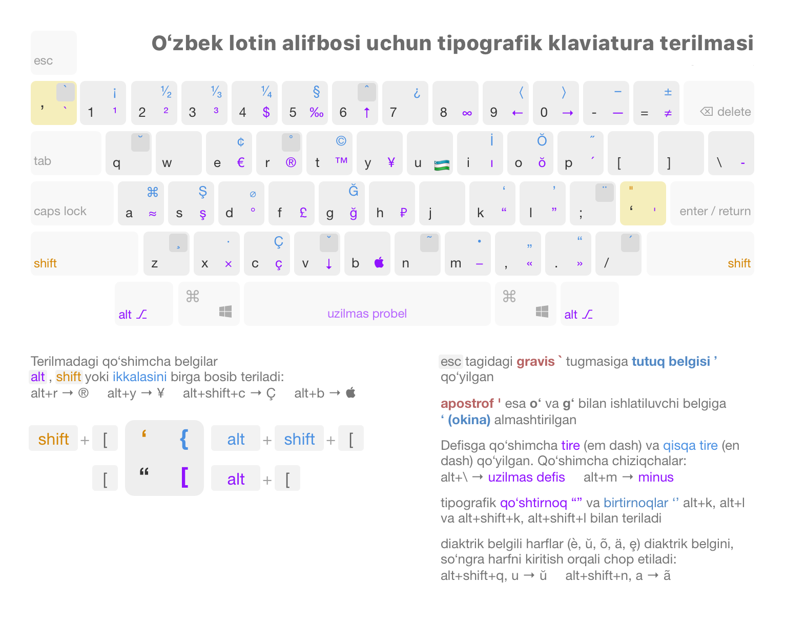

# Uzbek Keyboard Layout for Linux

A typographically correct keyboard layout for Uzbek, featuring 2023 alphabet updates and quick access to special characters.

## Layouts

This package provides four keyboard layout variants:

- **Uzbek (Standard):** The main layout with full typographic control.
  - Uses the correct **ʻOkina** (U+02BB) for _Oʻ/Gʻ_ and **Modifier Apostrophe** (U+02BC) for the _tutuq belgisi_.
  - Access to additional characters like **Ŏ, Ğ, Ş, Ç, İ** using the `AltGr` key.
- **Uzbek (US):** The standard US QWERTY layout with essential Uzbek characters available via `AltGr`.
  - `AltGr` + `'` → **ʻ** (Okina)
  - `AltGr` + `` ` `` → **ʼ** (Tutuq belgisi)
- **Uzbek (2023):** Based on the proposed 2023 alphabet update with single-character letters.
  - `W` → **Ş/ş**
  - `[` → **Õ/õ**
  - `]` → **Ğ/ğ**
- **Uzbek (Cyrillic):** A Cyrillic variant of the Uzbek keyboard layout.


_Detailed view of the **Uzbek (Standard)** layout. Purple keys require `AltGr`, blue keys require `Shift+AltGr`._

## Installation

### NixOS (Recommended)

Add this repository as a flake input to your `flake.nix`:

```nix
# flake.nix
{
  inputs = {
    ...
    # Add this line to your inputs
    uzbek-keyboard.url = "github:itsbilolbek/uzbek-linux-keyboard";
  }

  outputs = {
    ...
    # Add this line to your outputs
    uzbek-keyboard,
  } @ inputs:
  {
    nixosConfigurations."nixos" = nixpkgs.lib.nixosSystem {
      modules = {
        ...
        # Add this line to your modules
        uzbek-keyboard.nixosModules.module
      }
    }
  }
}
```

You can then use the provided layouts by adding them to your `configuration.nix`:

```nix
# configuration.nix
services.xserver.xkb.uz-enhanced.enable = true;
```

### Other Linux Distributions

1. Clone the repository:
  ```bash
  git clone https://github.com/itsbilolbek/uzbek-linux-keyboard.git
  cd uzbek-linux-keyboard
  ```

2. Run the installation script:
  ```bash
  sudo ./install.sh
  ```

## Usage

After installation, you may need to **log out and log back in**.

Then, go to your system's **Settings > Keyboard** (or **Input Sources**), search for **"Uzbek"**, and add your desired layout variant.

## License

This project is licensed under the MIT License. See the [LICENSE](LICENSE) file for details.
